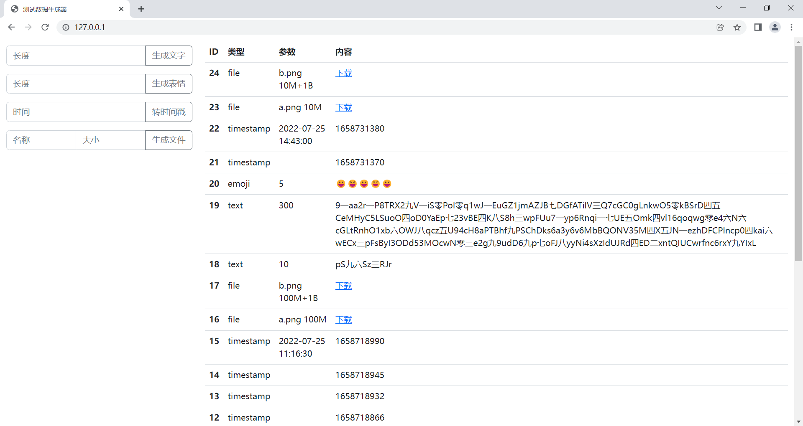
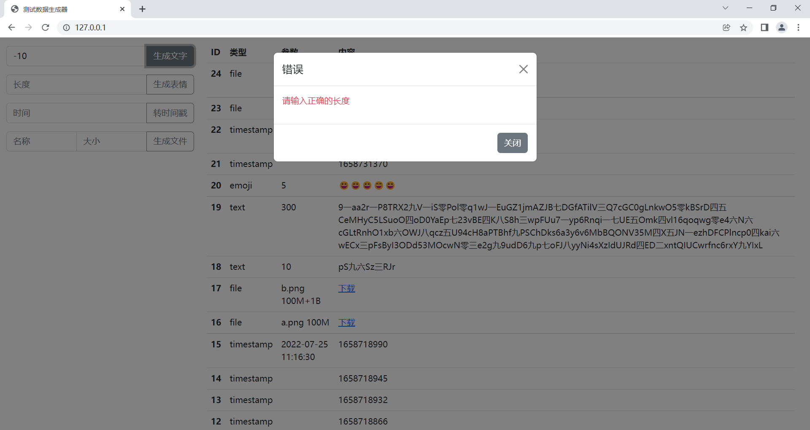

# Python Flask 测试数据生成器项目

## 课程介绍

Python Flask 是轻量级、扩展性强的 Web 开发框架，

本课程使用 Flask + Flask-SQLAlchemy + SQLite + jQuery + Bootstrap，带大家一步一步地实现一个测试数据生成器项目。

课程主要内容有：

1. 使用 Flask 搭建 Web 开发框架；
2. 使用 Flask 开发生成测试文本、测试表情、测试文件和转时间戳的接口；
3. 使用 Flask-SQLAlchemy 操作 SQLite 数据库；
4. 使用 Bootstrap 开发前端页面；
5. 使用 jQuery 实现接口异步调用。

## 项目截图

